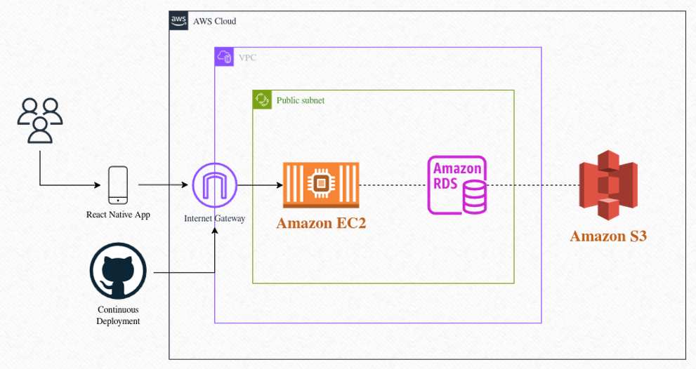

# 2025-Secondhand Marketplace

A mobile-first, gamified secondhand marketplace platform designed to maximise user engagement, trust, and trading efficiency.

---

## Project Overview

Secondhand Marketplace is an online platform for selling, browsing, and purchasing secondhand items. It bridges the gap between conventional e-commerce and interactive social experiences by focusing on user engagement, usability, and gamification.

### Core Focus Areas:
* **Reputation-Based User System:** Builds trust through transparent seller ratings, reviews, and community history.
* **Smart Recommendation Engine:** Delivers personalised item feeds based on granular user interactions.
* **Interactive Browsing Experience:** Enhances discovery using playful exploration paradigms like swipe mechanics.
* **Streamlined Buyer–Seller Flows:** Optimises negotiation, low-latency communication, and secure transaction success rates.

---

## Technology Stack

### Frontend & Backend
* **Frontend:** React Native, Expo Framework
* **Backend:** Python (Flask API Server)
* **Database:** PostgreSQL (Data Layer)
* **Development Tools:** Git, GitHub, GitHub Actions (CI/CD)

### System Architecture
<p align="left">
  
</p>

### Cloud Architecture
<p align="left">
  
</p>

---

## Client & Stakeholders

### Client
* **Marius Jurt:** A secondhand marketplace enthusiast focused on engagement, user-friendliness, and gamification. This project was developed in close collaboration with him to deliver an interactive, next-generation online marketplace experience.

### Key Stakeholders
* **Buyers:** Users looking to purchase items. They can search for specific items fitting their requirements or explore AI-recommended feeds. Since reliability is paramount, buyers can view detailed reviews of individual sellers and a directory of the platform's top-rated traders. They also utilise a user-friendly chat system for queries.
* **Sellers:** Users who list items for sale. They want to list and manage inventories with ease and be formally recognised for delivering accurate items on time through a transparent review and rating infrastructure.
* **Viewers:** Users who browse to explore availability or curate their aesthetic tastes (e.g., fashion, style trends) without immediate purchase intent. They require a fun, highly interactive system to discover items and effortlessly track sellers they might like.
* **Postal Service Providers:** External services responsible for logistics and fulfilment. They require accurate shipping data and streamlined application integration. Reliable delivery speeds directly protect the reputation of sellers and the marketplace's integrity.
* **Payment Service Providers:** External partners facilitating secure split-payment and refund architectures. High-volume security protocols are essential to solidify overall platform consumer trust.

---

## User Stories

* **As a Buyer,** I want my experience of online second-hand shopping to feel playful and exciting, unlike other static online stores. I want an engaging, interactive marketplace to easily discover target items, check seller ratings, and receive personalised recommendations tailored to my filters.
* **As a Seller,** I want a user-friendly interface to quickly list items I want to sell so that they seamlessly reach the right target audience. This friction-free loop encourages me to contribute to the circular economy instead of discarding usable goods.
* **As a Highly Rated Seller,** I want a robust reputation system that allows buyers to trust me explicitly, enabling me to build a distinct personal brand/identity and take an impactful, leading role within the trading community.

---

## User Flow

### Buyer Flow
1. **Authentication:** Open the app and sign up or log in securely.
2. **Discovery:** Scroll through the dashboard feed or swipe on the dedicated interactive exploration page with automatic item matching if the buyer also has active listings.
3. **Engagement:** Like specific items to save them to a personal collection.
4. **Review:** Navigate to the Likes page to review bookmarked items.
5. **Action:** Fill in required parameters on the transaction page and submit an official purchase offer.
6. **Fulfilment:** Await seller confirmation/acceptance and item dispatching.
7. **Feedback:** Submit a rating and review for the seller to update community reputation metrics.

### Seller Flow
1. **Authentication:** Open the app and sign up or log in securely.
2. **Creation:** Create image-backed product listings using the Add Items page.
3. **Management:** Dynamically edit details, update stock, or remove listings inside the MyListings dashboard.
4. **Negotiation:** Review incoming transaction requests to officially accept or decline consumer offers.

---

## Project Structure

```text
├── .github/                # CI/CD workflows and templates
├── ai-tools/               # AI/ML-driven tooling and helper scripts
├── backend/                # Flask API Server
│   ├── app/                # Core application logic & routes (Auth, Home, Listings)
│   ├── tests/              # Backend test suites
│   ├── requirements.txt    # Python dependencies
│   └── run.py              # Server entry point
├── database/               # PostgreSQL setup & migration scripts
│   ├── config.py           # Connection management
│   ├── main.py             # DB initialisation and migrations execution
│   └── *.sql               # Raw SQL schemas and seeding queries
├── frontend/               # React Native + Expo mobile app
│   ├── app/                # Expo Router (File-based routing)
│   │   ├── (tabs)/         # Main application navigation tabs
│   │   ├── auth/           # Authentication user flows
│   │   ├── items/          # Product details sub-pages
│   │   └── _layout.tsx     # Root layout and theme context providers
│   ├── components/         # Reusable UI components (Headers, Buttons)
│   ├── constants/          # Global design tokens (Colours, Spacing)
│   ├── hooks/              # Custom React hooks (Theme management)
│   ├── store/              # Global state management modules
│   └── package.json        # Node dependencies and npm run scripts
└── doc/                    # Project documentation & diagrams
    ├── meetings and feedback/ # Client meeting logs and supervisor notes
    └── others/             # Architecture diagrams, mockups, and roadmaps
```
## Dev Instructions
### Frontend Setup
Ensure you have Node.js installed on your machine.
1. Install dependencies

   ```bash
   npm install
   ```

2. Start the app

   ```bash
   npx expo start
   ```
   For some networks, such as eduroam, you will need to run the following instead
   ```bash
   npx expo install @expo/ngrok
   npx expo start --tunnel
   ```

In the output, you'll find options to open the app in a

- [development build](https://docs.expo.dev/develop/development-builds/introduction/)
- [Android emulator](https://docs.expo.dev/workflow/android-studio-emulator/)
- [iOS simulator](https://docs.expo.dev/workflow/ios-simulator/)
- [Expo Go](https://expo.dev/go), a limited sandbox for trying out app development with Expo

For this current iteration, you can run the frontend in an Expo Go app on your phone if you scan the QR code that is shown in the terminal. 

Alternatively, if you have a Mac, you can run the frontend in an iOS simulator (docs above)

If when starting the frontend, underneath the QR code it says ```Using development build```, press s on your keyboard to switch to Expo Go. It should now say ``` Using Expo Go``` which is what we want. 

### Backend Setup
Ensure you have Python 3.10+ installed on your machine.

#### Setup Environment and Install Dependencies

<details>
<summary><strong> Linux/Mac </strong></summary>

```bash
cd backend
python3 -m venv .venv
. .venv/bin/activate
pip install -r requirements.txt
```

</details>

<details>
<summary><strong> Windows </strong></summary>

```bash
cd backend
py -3 -m venv .venv
.venv\Scripts\activate
pip install -r requirements.txt
```

</details>

#### Run Locally

```bash
flask --app app run
```

## Project Management

We actively track milestones, epics, and tasks via GitHub Projects.
* **Kanban Board:** [Interactive Task Tracker](https://github.com/orgs/spe-uob/projects/348/views/1)
* **Gantt Chart:** [Project Timeline & Dependencies](https://github.com/orgs/spe-uob/projects/348/views/4)
* **Project Roadmap:** Detailed breakdown located at [`doc/others/Roadmap.md`](https://github.com/spe-uob/2025-SecondhandMarketplace2/blob/dev/docs/others/Roadmap.md)

---

## Team Members

| Name | Email |
| :--- | :--- |
| **Alex Hetherington** | ss24495@bristol.ac.uk |
| **Freddie De Bruyn** | ii24783@bristol.ac.uk |
| **Euan Chan** | AH24354@bristol.ac.uk |
| **Jen Lee** | dm24602@bristol.ac.uk |
