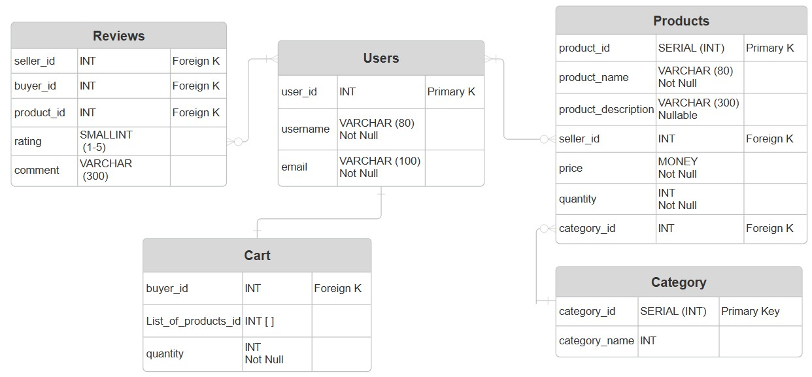

# Overview
This folder contains a PostgreSQL database schema. 
This directory contains the core data architecture, schema definitions, and management scripts for the Secondhand Marketplace project

## ER Diagram
<p align="left">
  
</p>
Diagram might need to be updated 

## Set up Instructions 
1. Prerequisites
  * PostgreSQL 16+ installed and running.
  * Python 3.10+ for running management scripts.
  * A .env file in the root or database folder with your credentials 
2. Initialization 
  To initialize the database from scratch (creating the database and applying the schema): 
  ```bash 
  python main.py --init
  ```
3. Seeding Data
  To populate the database with mock data for testing:
  ```bash
  python main.py --seed
  ```

  ## Structure
```text
database                           # Data Layer: PostgreSQL configuration and scripts
├── README.md                      # Database overview and structure 
├── config.py                      
├── main.py                        # Management script for DB init and migrations
└── *.sql                          # SQL scripts
``` 